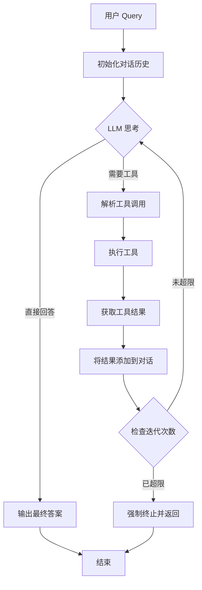

# Agent 架构设计文档

## 📐 整体架构

```
┌─────────────────────────────────────────────────────────────┐
│                      API Layer (FastAPI)                     │
│                         /api/agent                           │
└─────────────────────────────────────────────────────────────┘
                              │
                              ▼
┌─────────────────────────────────────────────────────────────┐
│                    Agent Core (LLM + Loop)                   │
│  ┌──────────────────────────────────────────────────────┐   │
│  │ 1. 接收用户 Query                                      │   │
│  │ 2. LLM 思考 & 决定工具调用                              │   │
│  │ 3. 执行工具                                            │   │
│  │ 4. 分析结果 & 循环                                       │   │
│  │ 5. 输出最终答案                                        │   │
│  └──────────────────────────────────────────────────────┘   │
└─────────────────────────────────────────────────────────────┘
                              │
              ┌───────────────┼───────────────┐
              ▼               ▼               ▼
    ┌─────────────┐  ┌─────────────┐  ┌─────────────┐
    │  RAG Tool   │  │ Bash Tool   │  │ Python Tool │
    │  (检索)     │  │  (命令)     │  │  (代码)     │
    └─────────────┘  └─────────────┘  └─────────────┘
              │               │               │
              ▼               ▼               ▼
    ┌─────────────┐  ┌─────────────┐  ┌─────────────┐
    │   Qdrant    │  │    Shell    │  │   Python    │
    │   Vector    │  │   Process   │  │  Sandbox    │
    │   DB        │  │             │  │             │
    └─────────────┘  └─────────────┘  └─────────────┘
```

## 🏗️ 目录结构

```
app/
├── main.py                      # FastAPI 应用入口
├── api/
│   └── routes.py                # API 路由定义
│       ├── POST /api/agent      # Agent 查询接口
│       └── POST /api/query      # RAG 快速检索接口
├── core/
│   └── config.py                # 配置管理
├── agent/                       # Agent 核心模块
│   ├── __init__.py              # 模块导出
│   ├── agent.py                 # Agent 核心实现（LLM + 循环 + 工具）
│   ├── llm.py                   # LLM 客户端封装
│   └── tools/                   # 工具集合
│       ├── __init__.py          # 工具注册表
│       ├── base.py              # 工具基类
│       ├── rag_tool.py          # RAG 检索工具
│       ├── bash_tool.py         # Bash 命令工具
│       ├── python_tool.py       # Python 执行工具
│       ├── web_search_tool.py   # 网络搜索工具
│       └── calculator_tool.py   # 计算器工具
└── services/                    # 底层服务（保持不变）
    ├── rag/                     # RAG 引擎
    ├── storage/                 # 存储层
    └── ingestion/               # 数据摄入
```

## 🔄 Agent 工作流程



### 详细步骤

1. **初始化阶段**
   - 加载系统提示词（包含工具描述）
   - 初始化工具列表
   - 设置最大迭代次数

2. **思考循环**
   ```python
   for iteration in range(max_iterations):
       # Step 1: LLM 思考
       response = llm.chat(messages, tools=available_tools)
       
       # Step 2: 检查是否有工具调用
       if response.has_tool_calls():
           # Step 3: 执行工具
           for tool_call in response.tool_calls:
               result = execute_tool(tool_call.name, tool_call.args)
               # Step 4: 将结果添加回对话
               messages.append({"role": "tool", "content": result})
       else:
           # Step 5: LLM 给出最终答案
           return response.content
   ```

3. **终止条件**
   - LLM 直接返回答案（无工具调用）
   - 达到最大迭代次数
   - 发生异常错误

## 🧩 工具系统设计

### 工具基类

```python
class BaseTool(ABC):
    @property
    @abstractmethod
    def name(self) -> str:
        """工具名称，用于 LLM 调用"""
        pass
    
    @property
    @abstractmethod
    def description(self) -> str:
        """工具描述，告诉 LLM 这个工具能做什么"""
        pass
    
    @property
    @abstractmethod
    def parameters(self) -> Dict[str, Any]:
        """工具参数的 JSON Schema"""
        pass
    
    @abstractmethod
    def execute(self, **kwargs) -> ToolResult:
        """执行工具"""
        pass
```

### 工具注册表

```python
TOOL_REGISTRY = {
    "rag": RAGTool,
    "bash": BashTool,
    "python": PythonTool,
    "web_search": WebSearchTool,
    "calculator": CalculatorTool,
}
```

### 工具执行流程

```
LLM 决定调用工具
      │
      ▼
解析工具名称和参数
      │
      ▼
查找工具实例
      │
      ▼
执行工具方法
      │
      ▼
返回 ToolResult
      │
      ├── success=True → 输出结果给 LLM
      └── success=False → 输出错误信息给 LLM
```

## 🔐 安全机制

### 1. Bash 命令安全

- **白名单机制**: 只允许特定命令
  ```python
  ALLOWED_COMMANDS = {"ls", "cat", "grep", "rg", "find", ...}
  ```

- **黑名单过滤**: 禁止危险操作
  ```python
  DANGEROUS_PATTERNS = ["rm ", "mv ", "cp ", "sudo", "|", ">", ...]
  ```

- **超时控制**: 防止命令挂起
  ```python
  timeout = 30  # 秒
  ```

- **目录限制**: 限制在指定目录内执行
  ```python
  cwd = settings.DATA_RAW_DIR
  ```

### 2. Python 代码安全

- **受限的全局变量**:
  ```python
  safe_globals = {
      "__builtins__": {
          "print": print,
          "len": len,
          # ... 只暴露安全的内置函数
      }
  }
  ```

- **受限的模块**:
  ```python
  allowed_modules = ["json", "re", "math", "datetime", ...]
  ```

- **输出捕获**: 使用 `redirect_stdout` 和 `redirect_stderr`

### 3. 路径安全

- **路径遍历防护**:
  ```python
  if not str(resolved_path).startswith(base_dir):
      raise SecurityError("不安全的路径访问")
  ```

## 🎯 LLM Function Calling

### OpenAI 兼容格式

```python
tools_schema = [
    {
        "type": "function",
        "function": {
            "name": "search_knowledge",
            "description": "在知识库中进行语义搜索",
            "parameters": {
                "type": "object",
                "properties": {
                    "query": {
                        "type": "string",
                        "description": "搜索查询"
                    },
                    "top_k": {
                        "type": "integer",
                        "description": "返回结果数量"
                    }
                },
                "required": ["query"]
            }
        }
    },
    # ... 其他工具
]
```

### LLM 响应解析

```python
# LLM 返回
{
    "content": "我来帮你查询...",
    "tool_calls": [
        {
            "id": "call_abc123",
            "function": {
                "name": "search_knowledge",
                "arguments": '{"query": "RAG", "top_k": 5}'
            }
        }
    ]
}

# 解析后
{
    "id": "call_abc123",
    "name": "search_knowledge",
    "arguments": {"query": "RAG", "top_k": 5}
}
```

## 📊 数据流

### 非流式请求

```
Client Request
      │
      ▼
┌─────────────┐
│ FastAPI     │
│ /api/agent  │
└─────────────┘
      │
      ▼
┌─────────────┐
│ Agent.run() │
│ 收集所有步骤 │
└─────────────┘
      │
      ▼
JSON Response
{
  "answer": "...",
  "steps": [...]
}
```

### 流式请求 (SSE)

```
Client Request (stream=true)
      │
      ▼
┌──────────────────┐
│ FastAPI          │
│ /api/agent       │
└──────────────────┘
      │
      ▼
┌─────────────────────┐
│ Agent.run_stream()  │
│ 逐步 yield 步骤      │
└─────────────────────┘
      │
      ▼
SSE Stream
data: {"type": "thinking", ...}
data: {"type": "tool_call", ...}
data: {"type": "tool_result", ...}
data: {"type": "final_answer", ...}
data: [DONE]
```

## ⚙️ 配置系统

### 环境变量 (.env)

```bash
# LLM 配置
LLM_API_KEY=sk-xxx
LLM_BASE_URL=https://api.deepseek.com/v1
LLM_MODEL=deepseek-chat

# Agent 配置
AGENT_MAX_ITERATIONS=10
BASH_TOOL_TIMEOUT=30
PYTHON_TOOL_TIMEOUT=30
BASH_WORK_DIR=data/raw

# 可选工具配置
SERPER_API_KEY=xxx  # 网络搜索
```

### Pydantic Settings

```python
class Settings(BaseSettings):
    # Agent 配置
    AGENT_MAX_ITERATIONS: int = 10
    BASH_TOOL_TIMEOUT: int = 30
    PYTHON_TOOL_TIMEOUT: int = 30
    BASH_WORK_DIR: Optional[str] = None
    
    model_config = SettingsConfigDict(
        env_file=".env",
        extra="ignore"
    )
```

## 🔧 扩展点

### 1. 添加新工具

```python
class MyNewTool(BaseTool):
    @property
    def name(self) -> str:
        return "my_new_tool"
    
    @property
    def description(self) -> str:
        return "我的新工具..."
    
    @property
    def parameters(self) -> Dict[str, Any]:
        return {...}
    
    def execute(self, **kwargs) -> ToolResult:
        # 实现逻辑
        pass

# 注册
register_tool("my_new", MyNewTool)
```

### 2. 自定义 Agent

```python
class CustomAgent(Agent):
    def _execute_tool(self, name, args) -> ToolResult:
        # 添加强化逻辑
        result = super()._execute_tool(name, args)
        
        # 例如：添加重试机制
        if not result.success:
            result = self._retry(name, args)
        
        return result
```

### 3. 自定义 LLM

```python
class CustomLLM(LLMClient):
    def chat(self, messages, tools=None):
        # 使用不同的 API
        response = self.call_custom_api(messages, tools)
        return self.parse_response(response)
```

## 📈 性能优化

### 1. 懒加载工具

```python
class RAGTool(BaseTool):
    def __init__(self):
        self._rag_engine = None
    
    @property
    def rag_engine(self):
        if self._rag_engine is None:
            self._rag_engine = RAGEngine()
        return self._rag_engine
```

### 2. 连接池

```python
# Qdrant 客户端使用连接池
client = QdrantClient(
    host=settings.QDRANT_HOST,
    port=settings.QDRANT_PORT,
    timeout=60
)
```

### 3. 缓存策略

```python
from functools import lru_cache

@lru_cache(maxsize=100)
def cached_search(query: str, top_k: int):
    return rag_engine.search(query, top_k)
```

## 🧪 测试策略

### 单元测试

```python
def test_calculator_tool():
    tool = CalculatorTool()
    result = tool.execute(expression="2 + 3 * 4")
    assert result.success == True
    assert "14" in result.output
```

### 集成测试

```python
def test_agent_with_rag():
    agent = Agent(tools=[RAGTool()])
    answer = agent.run("RAG 是什么？")
    assert len(answer) > 0
    assert "检索" in answer or "生成" in answer
```

### 端到端测试

```python
def test_api_agent_query():
    response = client.post("/api/agent", json={
        "query": "帮我查一下销售数据"
    })
    assert response.status_code == 200
    data = response.json()
    assert "answer" in data
    assert "steps" in data
```

## 🔍 调试技巧

### 日志级别

```python
# 开发环境
LOG_LEVEL=DEBUG

# 生产环境
LOG_LEVEL=WARNING
```

### 步骤追踪

```python
for step in agent.run_stream(query):
    logger.info(f"Step type: {step['type']}")
    logger.debug(f"Step content: {step['content']}")
```

### 工具调用追踪

```python
logger.info(f"🔧 执行工具：{name}")
logger.debug(f"参数：{arguments}")
logger.info(f"✅ 工具执行完成：success={result.success}")
```

## 📝 最佳实践

1. **工具设计原则**
   - 单一职责：每个工具只做一件事
   - 幂等性：工具执行应该是幂等的
   - 容错性：工具失败不应导致整个系统崩溃

2. **Prompt 优化**
   - 清晰的工具描述
   - 提供使用示例
   - 明确工作策略

3. **错误处理**
   - 捕获所有异常
   - 返回友好的错误信息
   - 记录详细日志

4. **性能考虑**
   - 设置合理的超时
   - 限制迭代次数
   - 使用异步 IO（未来优化）
